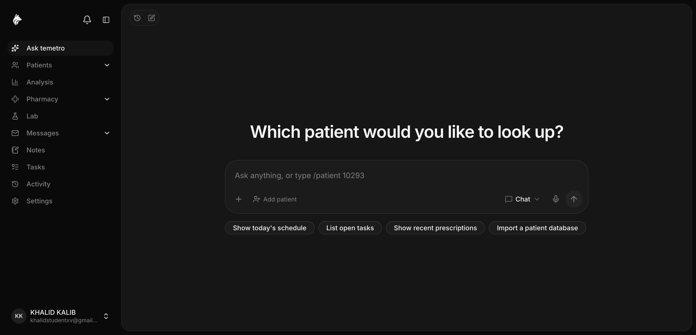

<div align="center">

# temetro

**An open-source AI middleman between clinicians and patient data.**

Clinicians ask in plain language; temetro retrieves and organizes patient
information as rich record cards — backed by a **patient-owned data model**.

[](./LICENSE)
[](https://hub.docker.com/u/khalidxv)
[](./CHANGELOG.md)



</div>

## What is temetro?

temetro is a clinical tool that puts a **natural-language AI chat** between
clinicians and patient records. Instead of clicking through tabs, a clinician
asks for what they need and temetro returns organized **record cards** —
vitals, labs, medications, problems, encounters — with trend sparklines and
detail views.

Its distinguishing idea is a **patient-owned data model**. Instead of (or
alongside) living only in a doctor's database, a patient's record can live on
the **patient's own device**. When a clinician adds or changes data they
**sign** it (blockchain-style); the change is written to the patient's record
and **cannot be modified until the patient approves it** through a companion
wallet app. temetro can also **read existing patient databases** and present
them in the same card UI.

> "Decentralization" here means keys and data live on the patient's device and
> the relay only ever forwards ciphertext — it is **not** a literal blockchain.
> Records are off-chain, which is what lets a temporary share be deleted.

## Features

- 🗂️ **AI chat over patient records** — `/patient <file#>` (or natural language)
  renders the record as cards with sparklines and detail dialogs.
- 🔐 **Auth & multi-tenant clinics** — email/password + staff usernames,
  organizations, and role-based access (owner / admin / doctor / reception /
  pharmacy / lab) via [Better Auth](https://better-auth.com).
- 🩺 **Full clinical surface** — patients, appointments, prescriptions, tasks,
  doctor's notes, pharmacy inventory, analytics, an activity audit log,
  real-time staff messaging, and notifications.
- 📲 **Patient wallet & encrypted share** — a companion app holds the record
  encrypted on-device; clinics import records over an end-to-end encrypted,
  patient-approved relay (with optional auto-deleting temporary shares).
- 🌐 **Works across the clinic LAN** — open it on the server or from any
  department's computer at `http://<server-IP>:3000`; no per-machine config.
- 🔄 **Self-update awareness** — the app tells admins when a newer release is
  out and how to update.

## Quick start (Docker)

The fastest path uses the **prebuilt images** published to Docker Hub. From the
[`backend/`](./backend) directory (it holds the Compose file):

```bash
cd backend
docker compose pull        # fetch the latest published images
docker compose up -d       # start Postgres + backend + frontend
```

No `.env` or secret setup is required — the backend generates and persists any
missing secrets on first start. Then open:

- **Frontend** → http://localhost:3000
- **Backend** → http://localhost:4000 (health: `GET /health`)

Prefer to **build from source** (for development)? Use `docker compose up
--build` instead. Migrations apply automatically on backend start.

> **Port conflict?** If host ports `5432`, `4000` or `3000` are already in use,
> set `POSTGRES_PORT`, `BACKEND_PORT` and/or `FRONTEND_PORT` (e.g. `5433` /
> `4001` / `3001`) in `backend/.env`. The services still talk to each other on
> their internal ports (`db:5432`, `backend:4000`); only the published host
> ports change.

### Access from other computers (hospital LAN)

temetro figures out the backend address from the host you open it on, so other
departments can simply visit **`http://<server-LAN-IP>:3000`** — no rebuild
needed. Settings → **About & updates** shows the exact shareable address. The
server's firewall must allow ports `3000`/`4000`.

### Updating

```bash
docker compose pull && docker compose up -d
```

The app surfaces a notification when a newer release exists. See
[`CHANGELOG.md`](./CHANGELOG.md) for what changed and [`RELEASING.md`](./RELEASING.md)
for how releases are built and published.

## Run without Docker

Each app runs independently (you'll need a local Postgres in `DATABASE_URL`):

```bash
# backend
cd backend && npm install && cp .env.example .env
npm run db:migrate && npm run dev      # http://localhost:4000

# frontend (second terminal)
cd frontend && npm install && npm run dev   # http://localhost:3000
```

> With `SMTP_HOST` unset, verification / reset / invitation emails are **printed
> to the backend console** — no email setup needed for local development.

## Monorepo layout

Two independent apps live side by side, each with its own `package.json` and
`CLAUDE.md`:

- **[`frontend/`](./frontend)** — Next.js 16 product app (the AI chat UI).
- **[`backend/`](./backend)** — Express 5 + Postgres API (Drizzle ORM + Better
  Auth). See [`backend/README.md`](./backend/README.md) for the API reference.

The **patient wallet app** and the **marketing landing page** live in their own
separate repositories.

## Tech stack

- **Frontend:** Next.js 16 (App Router) · React 19 · TypeScript · Tailwind CSS v4
  · i18next · Socket.io client.
- **Backend:** Node ≥ 20 · TypeScript (ESM) · Express 5 · Postgres · Drizzle ORM
  · Better Auth (email/password + organizations/RBAC) · Socket.io · AI SDK.

## Contributing

Issues and pull requests are welcome. Please keep each PR focused on one logical
change and run the type checks (`npm run typecheck` in `backend/`, `npx tsc
--noEmit` in `frontend/`) before opening it. Bug reports and feature requests
have [issue templates](./.github/ISSUE_TEMPLATE).

## License

[MIT](./LICENSE).
